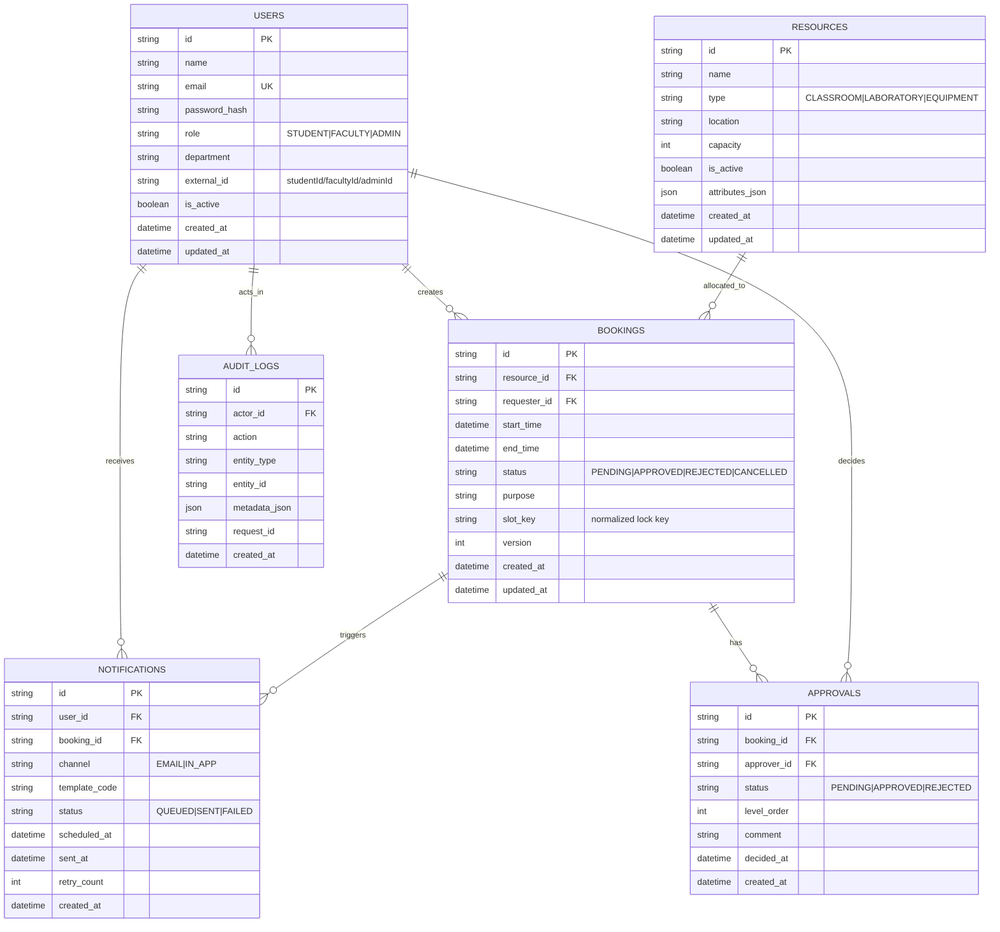

# CampusSync ER Diagram

## Constraints and Indexing Notes
- `USERS.email` must be unique.
- `BOOKINGS` must enforce `start_time < end_time`.
- Active overlap prevention:
  - App-level overlap query on `PENDING` and `APPROVED`.
  - Unique partial index idea: `(resource_id, slot_key)` where status in active states.
- Query-performance indexes:
  - `BOOKINGS(resource_id, start_time, end_time, status)`
  - `BOOKINGS(requester_id, created_at desc)`
  - `APPROVALS(booking_id, level_order)`
  - `AUDIT_LOGS(entity_type, entity_id, created_at desc)`
