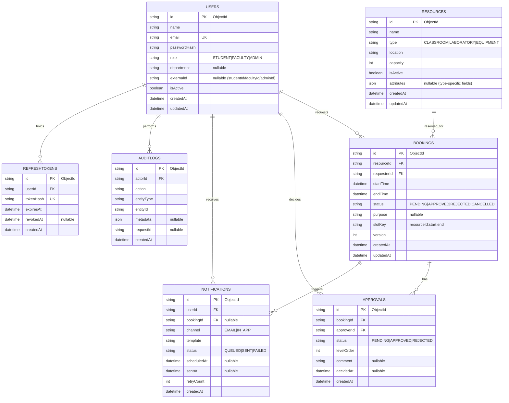

# CampusSync ER Diagram

## Constraints & Indexing (MongoDB + Prisma)
- Unique constraints:
  - `USERS.email`
  - `REFRESHTOKENS.tokenHash`
- High-impact indexes:
  - `BOOKINGS(resourceId, startTime, endTime, status)` for overlap detection
  - `BOOKINGS(requesterId, createdAt)` for user timelines
  - `APPROVALS(bookingId, levelOrder, status)` for workflow state
  - `NOTIFICATIONS(userId, status, scheduledAt)` for async dispatch
  - `AUDITLOGS(entityType, entityId, createdAt)` for governance queries
- Double-booking prevention:
  - Business-rule overlap query: `startTime < requestedEnd AND endTime > requestedStart` for active statuses (`PENDING`, `APPROVED`)
  - Concurrency protection: `slotKey` used as a lock key (application-level), plus optimistic `version` on updates

