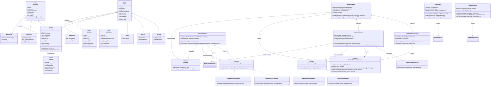

# CampusSync Class Diagram

```mermaid
classDiagram
    direction TB

    class User {
      <<entity>>
      +string id
      +string name
      +string email
      +string passwordHash
      +UserRole role
      +Date createdAt
      +Date updatedAt
      +isActive() bool
    }

    class Student {
      +string studentId
      +string department
      +int semester
    }

    class Faculty {
      +string facultyId
      +string department
      +bool canApprove
    }

    class Admin {
      +string adminId
      +string accessLevel
    }

    class Resource {
      <<entity>>
      +string id
      +string name
      +ResourceType type
      +string location
      +int capacity
      +bool isActive
      +AvailabilityWindow[] availability
    }

    class Classroom {
      +bool hasProjector
      +int seatingCapacity
    }

    class Laboratory {
      +string labCategory
      +bool requiresSupervisor
      +string[] safetyTags
    }

    class Equipment {
      +string equipmentCategory
      +int quantity
      +bool portable
    }

    class Booking {
      <<entity>>
      +string id
      +string resourceId
      +string requesterId
      +Date startTime
      +Date endTime
      +BookingStatus status
      +int version
      +Date createdAt
      +Date updatedAt
      +cancel(reason:string) void
      +transition(next:BookingStatus) void
    }

    class Approval {
      <<entity>>
      +string id
      +string bookingId
      +string approverId
      +ApprovalStatus status
      +string? comment
      +Date decisionAt
    }

    class Notification {
      <<entity>>
      +string id
      +string userId
      +NotificationChannel channel
      +string message
      +NotificationStatus status
      +Date scheduledAt
      +Date sentAt
    }

    class AuditLog {
      <<entity>>
      +string id
      +string actorId
      +string action
      +string entityType
      +string entityId
      +string metadataJson
      +Date createdAt
    }

    class BookingRepositoryInterface {
      <<interface>>
      +create(data:CreateBookingDTO) Booking
      +findById(id:string) Booking
      +findOverlaps(resourceId:string,start:Date,end:Date,statuses:BookingStatus[]) Booking[]
      +updateStatus(id:string,status:BookingStatus,version:int) Booking
      +cancel(id:string,reason:string,version:int) Booking
    }

    class NotificationStrategy {
      <<interface>>
      +send(notification:NotificationPayload) NotificationResult
    }

    class ApprovalStrategy {
      <<interface>>
      +execute(ctx:ApprovalContext) ApprovalDecision
    }

    class AutoApprovalStrategy {
      +execute(ctx:ApprovalContext) ApprovalDecision
    }

    class ManualApprovalStrategy {
      +execute(ctx:ApprovalContext) ApprovalDecision
    }

    class EmailNotificationStrategy {
      +send(notification:NotificationPayload) NotificationResult
    }

    class InAppNotificationStrategy {
      +send(notification:NotificationPayload) NotificationResult
    }

    class BookingService {
      -bookingRepo: BookingRepositoryInterface
      -conflictService: ConflictDetectionService
      -approvalService: ApprovalService
      -eventBus: EventBus
      +createBooking(dto:CreateBookingDTO,user:UserClaims) BookingDTO
      +cancelBooking(id:string,actor:UserClaims) BookingDTO
    }

    class ApprovalService {
      -approvalRepo: ApprovalRepository
      -bookingRepo: BookingRepositoryInterface
      -strategyFactory: ApprovalStrategyFactory
      -eventBus: EventBus
      +executeWorkflow(booking:Booking) ApprovalDecision
      +processDecision(bookingId:string,action:DecisionAction,actor:UserClaims) ApprovalDecision
    }

    class AuthService {
      -userRepo: UserRepository
      -jwtProvider: JwtProvider
      -refreshTokenRepo: RefreshTokenRepository
      +register(dto:RegisterDTO) AuthResponseDTO
      +login(dto:LoginDTO) AuthResponseDTO
      +refresh(token:string) AuthResponseDTO
    }

    class NotificationService {
      -strategies: Map~NotificationChannel, NotificationStrategy~
      -notificationRepo: NotificationRepository
      +dispatch(event:DomainEvent) void
      +send(channel:NotificationChannel,payload:NotificationPayload) NotificationResult
    }

    class ConflictDetectionService {
      -bookingRepo: BookingRepositoryInterface
      -lockManager: LockManager
      +checkConflict(resourceId:string,start:Date,end:Date) bool
      +withLock(slotKey:string,fn:Function) any
    }

    class AnalyticsService {
      -bookingRepo: BookingRepositoryInterface
      -auditRepo: AuditLogRepository
      +getUtilization(range:DateRange) UtilizationDTO
      +getApprovalMetrics(range:DateRange) ApprovalMetricsDTO
      +getPeakHours(range:DateRange) PeakHoursDTO
    }

    class ApprovalStrategyFactory {
      +resolve(policy:ApprovalPolicy) ApprovalStrategy
    }

    class EventBus {
      <<singleton>>
      +publish(event:DomainEvent) void
      +subscribe(type:string,handler:EventHandler) void
    }

    User <|-- Student
    User <|-- Faculty
    User <|-- Admin

    Resource <|-- Classroom
    Resource <|-- Laboratory
    Resource <|-- Equipment

    ApprovalStrategy <|.. AutoApprovalStrategy
    ApprovalStrategy <|.. ManualApprovalStrategy
    NotificationStrategy <|.. EmailNotificationStrategy
    NotificationStrategy <|.. InAppNotificationStrategy

    User "1" o-- "*" Booking : requester
    Resource "1" o-- "*" Booking : reservedIn
    Booking "1" o-- "*" Approval : decisionHistory
    User "1" o-- "*" Notification : receives
    User "1" o-- "*" AuditLog : performs

    BookingService *-- ConflictDetectionService : composes
    BookingService *-- ApprovalService : composes
    ApprovalService o-- ApprovalStrategyFactory : aggregates
    NotificationService o-- NotificationStrategy : aggregates

    BookingService --> BookingRepositoryInterface : injected
    ApprovalService --> BookingRepositoryInterface : injected
    ConflictDetectionService --> BookingRepositoryInterface : injected
    AuthService --> UserRepository : injected
    NotificationService --> NotificationRepository : injected
    AnalyticsService --> AuditLogRepository : injected

    ApprovalService --> ApprovalStrategy : uses polymorphism
    NotificationService --> NotificationStrategy : uses polymorphism
    BookingService --> EventBus : publishes events
    ApprovalService --> EventBus : publishes events
    NotificationService --> EventBus : subscribes
```
