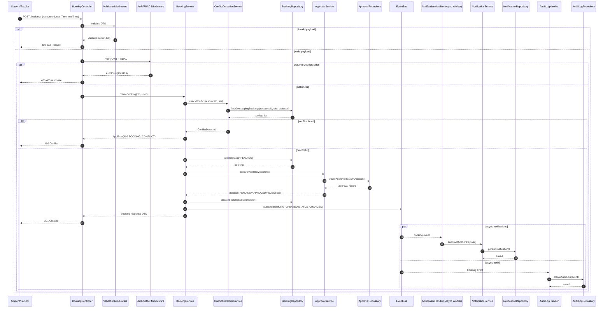
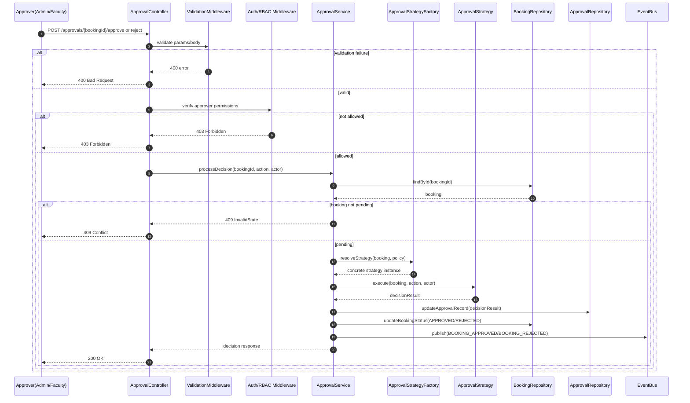
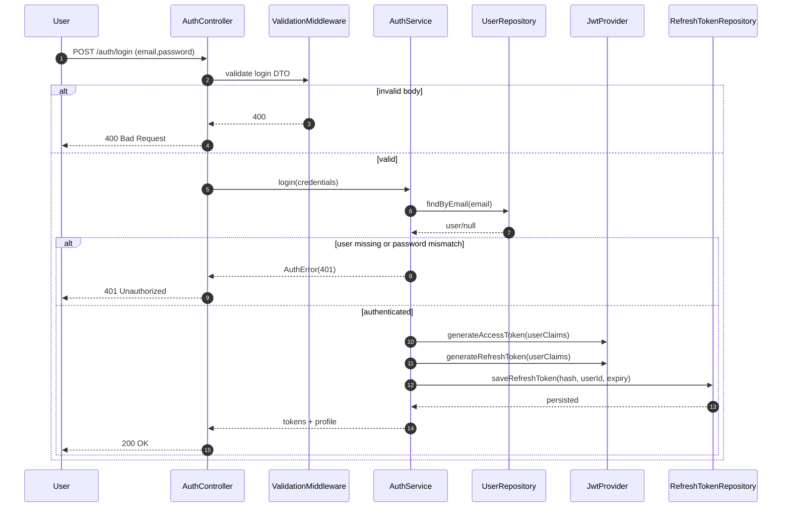
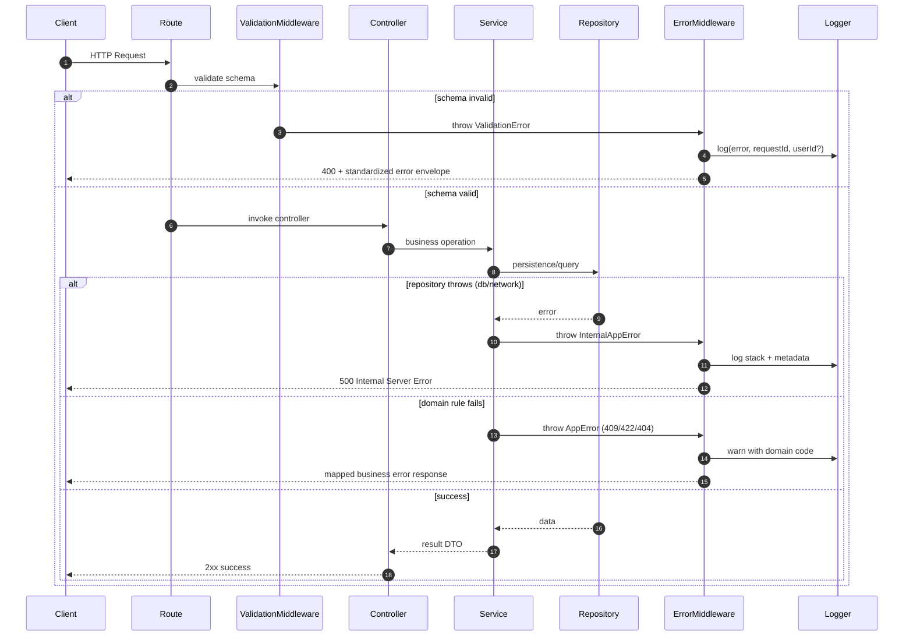
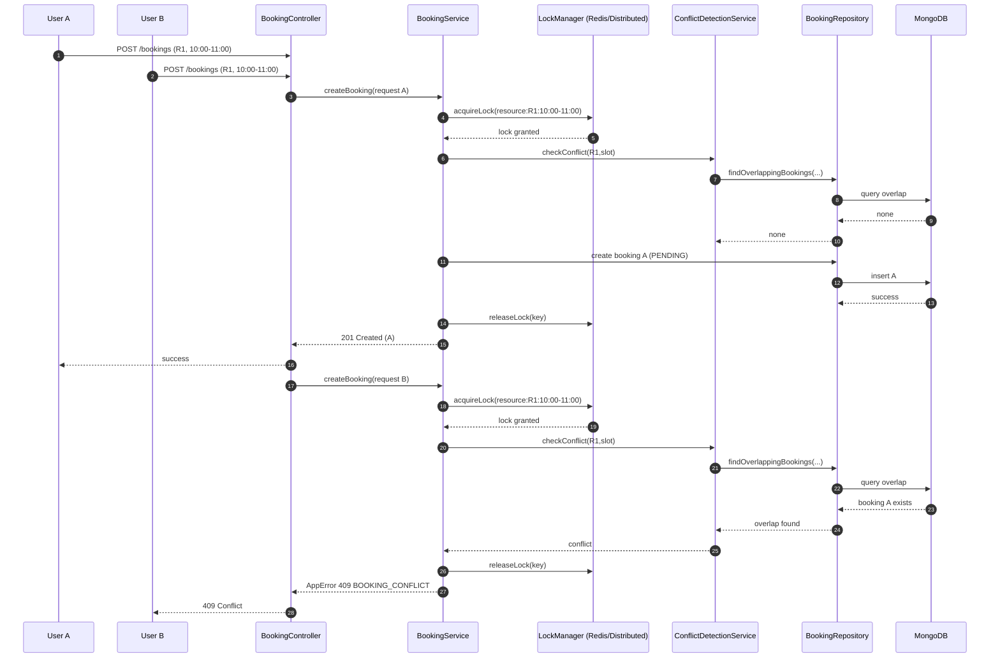

# CampusSync Sequence Diagrams

## A. Booking Request -> Conflict Check -> Approval -> Notification

## B. Approval Workflow Execution Flow

## C. Authentication Flow

## D. Validation & Error Handling Flow

## E. Concurrency-Safe Booking (Two Users Same Slot)

