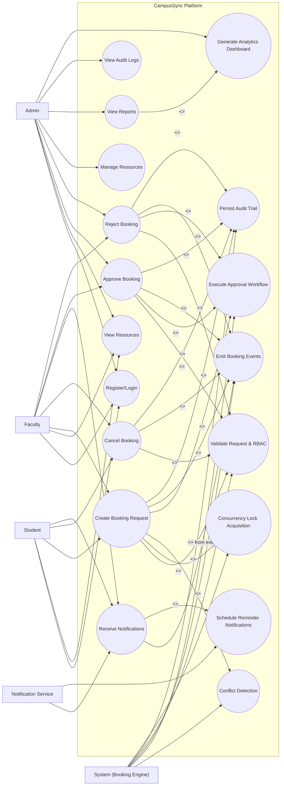

# CampusSync Use Case Diagram

```mermaid
flowchart LR
    %% Actors
    Student["Student"]
    Faculty["Faculty"]
    Admin["Admin"]
    BookingEngine["System (Booking Engine)"]
    NotificationService["Notification Service"]

    %% System boundary
    subgraph CampusSync["CampusSync Platform"]
      UC1(("Register/Login"))
      UC2(("View Resources"))
      UC3(("Create Booking Request"))
      UC4(("Cancel Booking"))
      UC5(("Approve Booking"))
      UC6(("Reject Booking"))
      UC7(("Manage Resources"))
      UC8(("View Reports"))
      UC9(("Receive Notifications"))
      UC10(("View Audit Logs"))
      UC11(("Conflict Detection"))
      UC12(("Execute Approval Workflow"))
      UC13(("Generate Analytics Dashboard"))
      UC14(("Emit Booking Events"))
      UC15(("Validate Request & RBAC"))
      UC16(("Persist Audit Trail"))
      UC17(("Schedule Reminder Notifications"))
      UC18(("Concurrency Lock Acquisition"))
    end

    Student --> UC1
    Student --> UC2
    Student --> UC3
    Student --> UC4
    Student --> UC9

    Faculty --> UC1
    Faculty --> UC2
    Faculty --> UC3
    Faculty --> UC4
    Faculty --> UC9
    Faculty --> UC5
    Faculty --> UC6

    Admin --> UC1
    Admin --> UC2
    Admin --> UC5
    Admin --> UC6
    Admin --> UC7
    Admin --> UC8
    Admin --> UC10
    Admin --> UC13

    BookingEngine --> UC11
    BookingEngine --> UC12
    BookingEngine --> UC14
    BookingEngine --> UC15
    BookingEngine --> UC16
    BookingEngine --> UC18

    NotificationService --> UC9
    NotificationService --> UC17

    UC3 -->|"<<include>>"| UC15
    UC3 -->|"<<include>>"| UC18
    UC3 -->|"<<include>>"| UC11
    UC3 -->|"<<include>>"| UC12
    UC3 -->|"<<include>>"| UC14
    UC3 -->|"<<include>>"| UC16

    UC4 -->|"<<include>>"| UC15
    UC4 -->|"<<include>>"| UC14
    UC4 -->|"<<include>>"| UC16

    UC5 -->|"<<include>>"| UC15
    UC5 -->|"<<include>>"| UC12
    UC5 -->|"<<include>>"| UC14
    UC5 -->|"<<include>>"| UC16

    UC6 -->|"<<include>>"| UC15
    UC6 -->|"<<include>>"| UC12
    UC6 -->|"<<include>>"| UC14
    UC6 -->|"<<include>>"| UC16

    UC8 -->|"<<include>>"| UC13
    UC9 -->|"<<extend>> from events"| UC14
    UC9 -->|"<<include>>"| UC17
```
